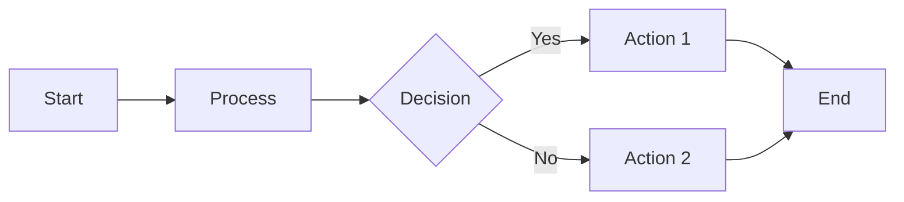
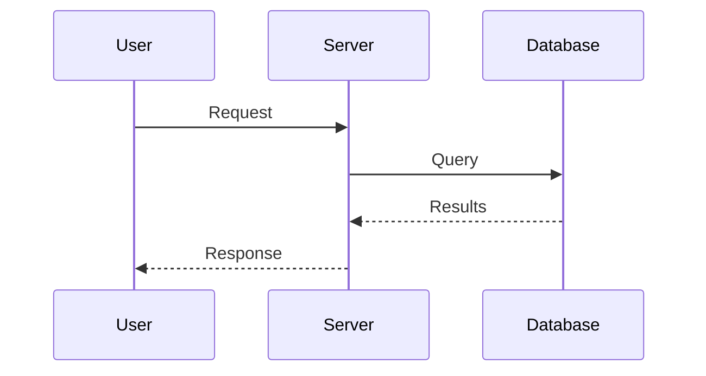
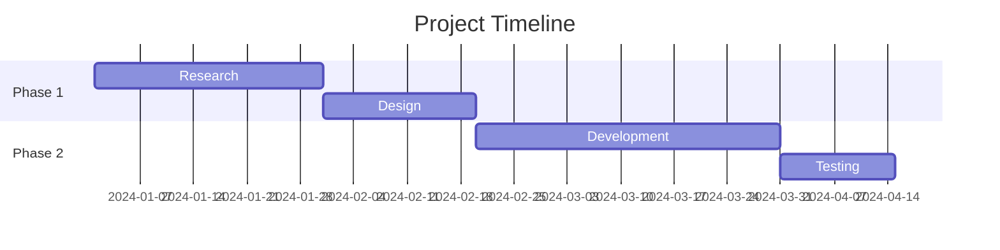
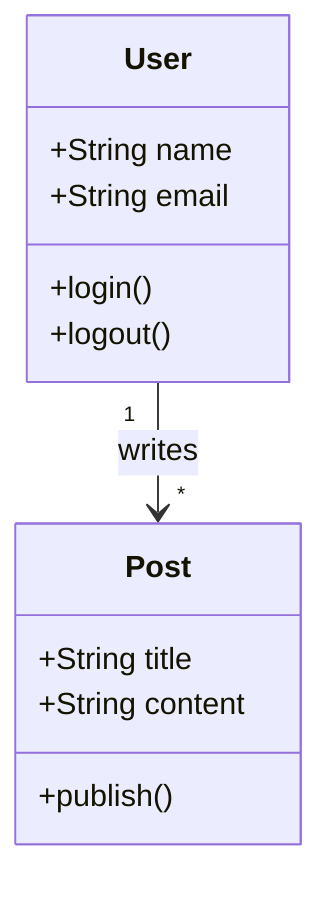

### Creating a New Post

Use the provided script to generate a new post template:

```bash
ruby ./bin/new_post.rb my-first-post
```

This creates `_posts/YYYY-MM-DD-my-first-post.md` with today's date and a
ready-to-edit template.

### Post Front Matter

Every post begins with YAML front matter:

```yaml
---
layout: post
section-type: post
has-comments: true
title: Your Post Title
category: tech
tags: ["jekyll", "tutorial"]
---
```

| Field          | Description                      |
| -------------- | -------------------------------- |
| `layout`       | Always use `post` (required)     |
| `section-type` | Always use `post` (required)     |
| `has-comments` | Enable/disable Disqus comments   |
| `title`        | Your post's display title        |
| `category`     | Single category for organization |
| `tags`         | Array of hashtags for discovery  |

### Generating Tag Pages

After adding new tags, generate their pages:

```bash
ruby ./bin/generate_tags.rb
```

This scans all posts and creates pages for any new tags in the `tags/`
directory.

### Generating Category Pages

Similarly, generate category pages:

```bash
ruby ./bin/generate_categories.rb
```

Category pages are created in the `categories/` directory.

### Syntax Highlighting

The theme includes the Everforest Dark syntax theme. Use fenced code blocks with
language identifiers:

````markdown
```python
def hello_world():
    print("Hello, World!")
```
````

Renders as:

```python
def hello_world():
    print("Hello, World!")
```

Supported languages include: `python`, `javascript`, `ruby`, `c`, `cpp`, `java`,
`bash`, `yaml`, `json`, `html`, `css`, `scss`, and many more.

### Markdown Features

Your posts support full GitHub-flavored Markdown:

- **Bold** and _italic_ text
- [Links](https://example.com)
- Images: ``
- Lists (ordered and unordered)
- Blockquotes
- Tables
- Task lists

### Mermaid Diagrams

Create diagrams directly in your posts using Mermaid syntax. The theme includes
the `jekyll-spaceship` plugin which renders Mermaid diagrams automatically.

#### Flowcharts

````markdown

````

#### Sequence Diagrams

````markdown

````

#### Gantt Charts

````markdown

````

#### Class Diagrams

````markdown

````

Mermaid supports many more diagram types including pie charts, state diagrams,
and entity-relationship diagrams. See the
[Mermaid documentation](https://mermaid.js.org/) for the full syntax reference.

### Tips for Great Posts

- Use descriptive, SEO-friendly titles
- Add relevant tags for discoverability
- Include images to break up text
- Keep paragraphs short for readability
- Preview locally before publishing
